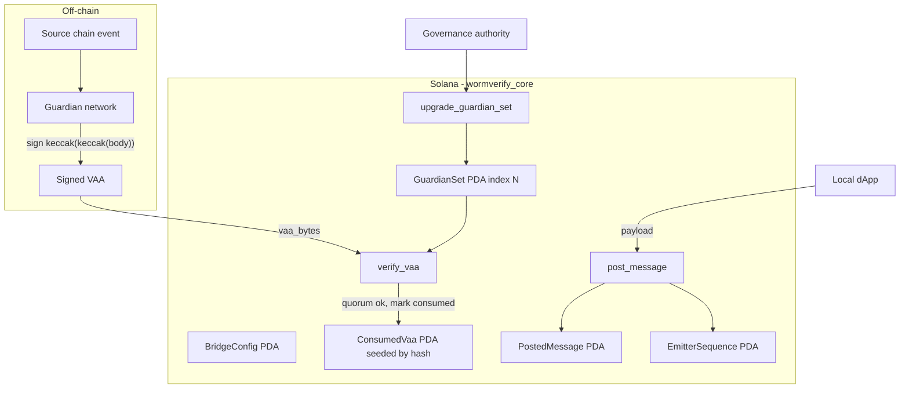
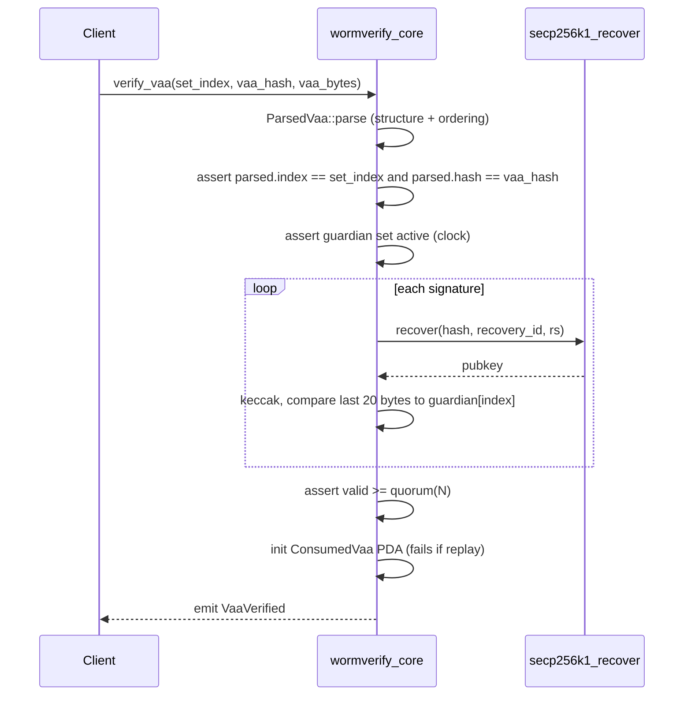

# WormVerify 🛡️🌉

> An on-chain **Wormhole-style verification core** for Solana: guardian-set management,
> `N-of-M` secp256k1 **VAA verification**, replay protection, message emission, and governance —
> written in Rust with the Anchor framework.

[](https://github.com/ABHIJEET-MUNESHWAR/WormVerify/actions)
[](https://www.anchor-lang.com/)
[](https://solana.com/)
[](./LICENSE)
[](https://github.com/ABHIJEET-MUNESHWAR/WormVerify/stargazers)
[](https://github.com/ABHIJEET-MUNESHWAR/WormVerify/issues)
[](https://github.com/ABHIJEET-MUNESHWAR/WormVerify/commits/main)

---

## Table of Contents

1. [What it is](#what-it-is)
2. [Why it matters](#why-it-matters)
3. [Architecture](#architecture)
4. [Component details](#component-details)
5. [Instruction flows](#instruction-flows)
6. [VAA wire format](#vaa-wire-format)
7. [Security model](#security-model)
8. [Time & space complexity](#time--space-complexity)
9. [Project structure](#project-structure)
10. [Build, test & run](#build-test--run)
11. [Test results](#test-results)
12. [Design guideline mapping](#design-guideline-mapping)
13. [Roadmap](#roadmap)

---

## What it is

WormVerify implements the security-critical heart of a cross-chain bridge — the same
primitive [Wormhole](https://wormhole.com) maintains on Solana:

- **Guardian sets** — indexed, immutable sets of Ethereum-style guardian addresses, with
  monotonic rotation and TTL-based expiry of superseded sets.
- **VAA verification** — parses a canonical Wormhole VAA, recovers each guardian signature
  with the `secp256k1_recover` syscall, and requires a `floor(2/3·N)+1` **supermajority quorum**
  over `keccak256(keccak256(body))`.
- **Replay protection** — the first successful verification creates a PDA seeded by the VAA
  digest; a replayed VAA fails at account initialization.
- **Message emission** — local programs post outbound messages with per-emitter **monotonic
  sequence numbers** that off-chain guardians observe.
- **Governance** — the configured authority rotates the guardian set.

## Why it matters

A bridge is only as trustworthy as its message-authentication core. This program encodes the
exact invariants that keep a bridge safe: no forged VAA, no replayed VAA, no under-quorum VAA,
no double-counted guardian, and no signature over a mutated body can ever pass verification —
and those invariants are enforced by unit + real-signature integration tests.

## Architecture



## Component details

| Module | Responsibility | Key types / fns |
|---|---|---|
| `vaa` | Pure VAA parsing, double-keccak digest, quorum math (validator-independent, unit-testable) | `ParsedVaa::parse`, `body_digest`, `quorum` |
| `verify` | secp256k1 signature recovery + guardian-address derivation + quorum enforcement | `verify_quorum`, `guardian_address_from_pubkey` |
| `state` | Anchor account definitions & rent sizing | `BridgeConfig`, `GuardianSet`, `ConsumedVaa`, `PostedMessage` |
| `error` | Stable, branch-able error codes | `WormError` |
| `lib` | Instruction handlers + account contexts + events | `initialize`, `verify_vaa`, `post_message`, `upgrade_guardian_set` |

**Accounts / PDAs**

| Account | Seeds | Purpose |
|---|---|---|
| `BridgeConfig` | `["config"]` | Governance authority, chain id, active set index, TTL |
| `GuardianSet` | `["guardian_set", index_le]` | Immutable guardian address set at an index |
| `ConsumedVaa` | `["consumed", vaa_hash]` | Replay marker; init fails on replay |
| `EmitterSequence` | `["emitter", emitter]` | Per-emitter monotonic counter |
| `PostedMessage` | `["message", emitter, seq_le]` | An emitted outbound message |

## Instruction flows

**Verify a VAA (the hot path):**



**Post a message:** assign `EmitterSequence.sequence`, persist `PostedMessage`, increment counter, `emit MessagePosted`.

**Upgrade guardian set:** governance authority signs → new index must be `current + 1` → old set gets a bounded `expiration_time` (TTL) so in-flight VAAs remain verifiable → new set becomes active.

## VAA wire format

```text
header:
  version            u8      (== 1)
  guardian_set_index u32be
  num_signatures     u8
  signatures[]       guardian_index u8 || rs [64] || recovery_id u8   (strictly ascending index)
body (hashed as keccak(keccak(body))):
  timestamp          u32be
  nonce              u32be
  emitter_chain      u16be
  emitter_address    [32]
  sequence           u64be
  consistency_level  u8
  payload            variable (<= 1024 bytes)
```

## Security model

| Attack | Defense |
|---|---|
| Forged VAA | Every signature must recover to an address in the on-chain guardian set |
| Under-quorum VAA | `valid >= floor(2/3·N)+1` enforced |
| Duplicate-guardian inflation | Signatures must be **strictly ascending** by guardian index (parse-time) |
| Replayed VAA | `ConsumedVaa` PDA seeded by digest; `init` fails on second use |
| Body tampering | Digest is `keccak(keccak(body))`; any mutation invalidates all signatures |
| Wrong guardian set | Caller-supplied `set_index`/`hash` are re-derived and asserted equal |
| Expired set reuse | `GuardianSet::is_active(now)` checked against the clock |
| Signature malleability | `secp256k1_recover` rejects high-S signatures and `recovery_id > 1` |
| Unauthorized rotation | `upgrade_guardian_set` gated by the governance-authority signer |
| Sequence overflow | `checked_add` returns `WormError::Overflow` |

## Time & space complexity

Let `N` = guardian-set size, `S` = number of signatures on a VAA, `P` = payload bytes.

| Operation | Time | Space (accounts) |
|---|---|---|
| `ParsedVaa::parse` | `O(S + P)` | `O(1)` borrow |
| `body_digest` | `O(P)` (2 keccak passes) | `O(1)` |
| `verify_quorum` | `O(S)` recoveries (each a fixed-cost syscall) | `O(1)` |
| `verify_vaa` (total) | `O(S + P)` | 1 new `ConsumedVaa` |
| `post_message` | `O(P)` | 1 `PostedMessage` (+ maybe `EmitterSequence`) |
| `upgrade_guardian_set` | `O(N)` copy | 1 new `GuardianSet` |

Quorum for `N = 19` is `13`; each recovery is a constant-cost SVM syscall, so verification cost
is linear in the number of signatures presented.

## Project structure

```
WormVerify/
├── anchor/
│   ├── Anchor.toml
│   ├── Cargo.toml                     # release: overflow-checks, fat LTO
│   └── programs/wormverify-core/
│       ├── Cargo.toml
│       ├── src/
│       │   ├── lib.rs                 # instructions, accounts, events
│       │   ├── vaa.rs                 # parsing + digest + quorum (pure)
│       │   ├── verify.rs              # secp256k1 recovery + quorum check
│       │   ├── state.rs               # account definitions
│       │   └── error.rs               # WormError codes
│       └── tests/verify_integration.rs # real secp256k1 end-to-end tests
├── Dockerfile                         # reproducible verifiable build
├── .github/workflows/ci.yml           # fmt + clippy + test + audit
├── rust-toolchain.toml
└── README.md
```

## Build, test & run

```bash
# From the anchor workspace
cd anchor

# Host build (fast) + unit + real-signature integration tests
cargo build
cargo test

# Lint & format gates (match CI)
cargo fmt --all -- --check
cargo clippy --all-targets -- -D warnings

# Verifiable BPF build of the program artifact
anchor build          # or: docker build -t wormverify . && docker run --rm wormverify
```

## Test results

Real output from `cargo test` (Rust 1.95, host target):

```text
running 7 tests (lib: vaa + verify unit tests)
test result: ok. 7 passed; 0 failed; 0 ignored

running 4 tests (verify_integration: real secp256k1 signatures)
test signature_over_different_body_fails ... ok
test below_quorum_is_rejected ... ok
test quorum_of_real_signatures_verifies ... ok
test signature_from_foreign_guardian_fails ... ok
test result: ok. 4 passed; 0 failed; 0 ignored
```

| Suite | Tests | What it proves |
|---|---:|---|
| `vaa` unit | 4 | quorum math, parse round-trip, unsorted/truncated rejection, double-keccak digest |
| `verify` unit | 1 | Ethereum-address derivation |
| `lib` doctest | 2 | — |
| `verify_integration` | 4 | real-signature quorum, below-quorum reject, tampered-body reject, foreign-guardian reject |

## Design guideline mapping

See [`EVALUATION.md`](./EVALUATION.md) for a point-by-point mapping to the 28 engineering
guidelines (SOLID, type-safety, error handling, resilience, testing, observability, complexity,
CI/CD, Docker, self-evaluation).

## Roadmap

- [ ] `wormverify-relayer` off-chain crate (Tokio): watch `PostedMessage`, aggregate guardian
      signatures, submit VAAs — GraphQL API + resilience (timeout/retry/circuit-breaker/rate-limit)
      + Prometheus metrics, mirroring the hexagonal pattern used across the author's other services.
- [ ] `anchor test` TypeScript suite against a local validator (full ed25519/secp256k1 tx path).
- [ ] Governance-VAA driven guardian-set upgrades (payload-encoded, verified on-chain).
